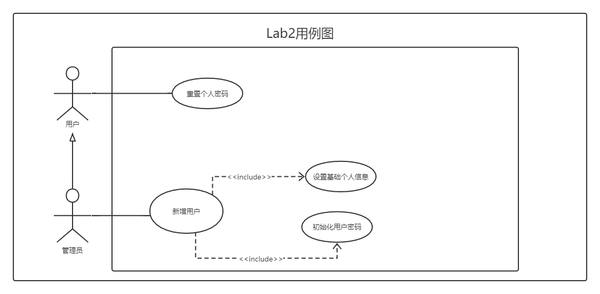
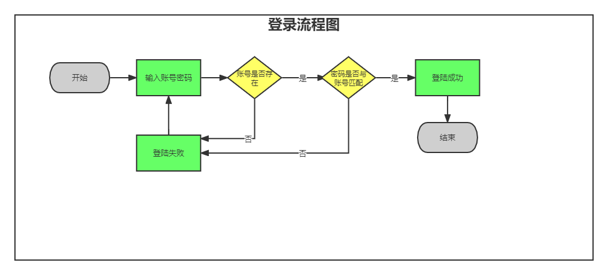
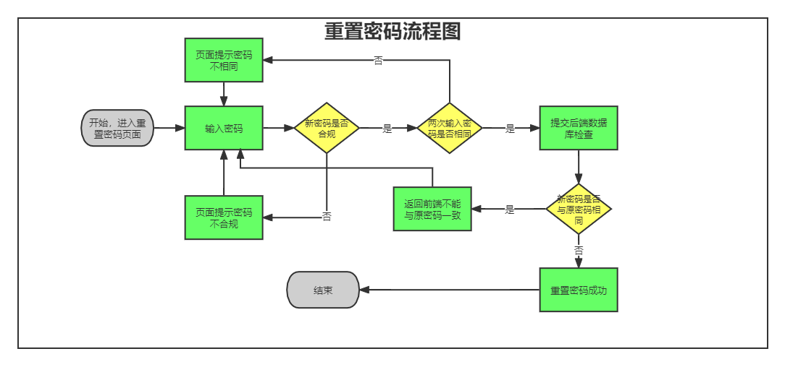
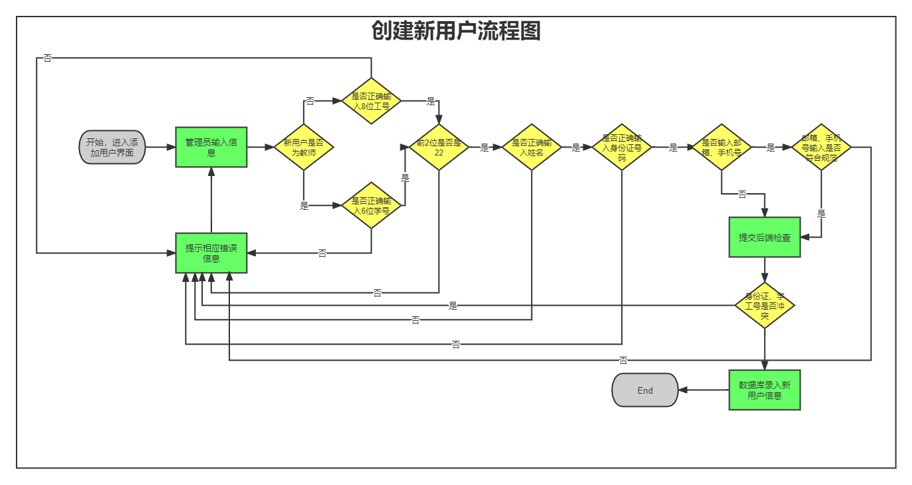

# 第16小组-Lab2实验报告

## 一、小组成员及分工

**买巫予骜：**前端；负责登陆页面、密码重置页面、功能页面的HTML、CSS及JS文件开发；系统功能测试；实验报告撰写及提交。

**陆一杨：**

**胡乐垚：**主要负责后端，完成视图控制、拦截器以及新增用户的服务。

**李文军：**后端； 实体类和表格的构建、默认管理员的生成、录入用户时对于输入信息的格式规则的判断提示、以及登陆时和初次登陆后跳转重置密码

## 二、测试用例

### （1）登录界面

| 编号  | 用例名称                           | 前置条件     |   测试环境   | 测试类型 | 测试步骤                                               | 预期结果                       | 实际结果       | 测试执行人 | 代码编写人 | 是否解决 | 修改人 |
| :---: | ---------------------------------- | ------------ | :----------: | -------- | ------------------------------------------------------ | ------------------------------ | -------------- | ---------- | ---------- | -------- | ------ |
| **1** | 正确输入管理员账号密码             | 初始化系统后 | Chrome浏览器 | 手工测试 | 1、输入管理员账号000000;2、输入管理员密码fudan_admin。 | 正常登录，跳转至主页。         | 与预期结果相同 | 买巫予骜   | 买巫予骜   |          |        |
| **2** | 正确输入用户账号密码（首次登录）   | 用户已添加   | Chrome浏览器 | 手工测试 | 1、输入已注册用户账号。2、输入已注册用户密码。         | 正常登录，跳转至密码重置页面。 | 与预期结果相同 | 买巫予骜   | 买巫予骜   |          |        |
| **3** | 正确输入用户账号密码（非首次登录） | 用户已添加   | Chrome浏览器 | 手工测试 | 1、输入已注册用户账号。2、输入已注册用户密码。         | 正常登录，跳转至主页。         | 与预期结果相同 | 买巫予骜   | 买巫予骜   |          |        |
| **4** | 错误输入用户（管理员）账号或密码   | 初始化系统后 | Chrome浏览器 | 手工测试 | 1、错误输入用户账号。2、错误输入用户密码。             | 登录失败，网页提示错误信息。   | 与预期结果相同 | 买巫予骜   | 买巫予骜   |          |        |

### （2）密码重置界面

| 编号  | 用例名称                 | 前置条件         |   测试环境   | 测试类型 | 测试步骤                                                 | 预期结果                               | 实际结果                       | 测试执行人 | 代码编写人 | 是否解决 | 修改人   |
| :---: | ------------------------ | ---------------- | :----------: | -------- | -------------------------------------------------------- | -------------------------------------- | ------------------------------ | ---------- | ---------- | -------- | -------- |
| **1** | 正确输入符合要求的新密码 | 用户第一次登录后 | Chrome浏览器 | 手工测试 | 1、输入合规新密码;                 2、再次输入相同密码。 | 密码重置成功，跳转至主页。             | 与预期结果相同                 | 买巫予骜   | 买巫予骜   |          |          |
| **2** | 两次输入密码不一致       | 用户第一次登录后 | Chrome浏览器 | 手工测试 | 1、输入合规新密码;                 2、再次输入不同密码。 | 密码重置失败，页面提示信息。           | 密码重置失败，页面无提示信息。 | 买巫予骜   | 买巫予骜   | 是       | 买巫予骜 |
| **3** | 新密码不合规（长度）     | 用户第一次登录后 | Chrome浏览器 | 手工测试 | 1、输入长度不合规的密码; 2、再次输入                     | 密码重置失败，提示密码格式错误。       | 与预期结果相同                 | 买巫予骜   | 买巫予骜   |          |          |
| **4** | 新密码不合规（字符集）   | 用户第一次登录后 | Chrome浏览器 | 手工测试 | 1、输入字符集不合规的密码; 2、再次输入                   | 密码重置失败，提示密码格式错误。       | 未提示，可以直接登录           | 买巫予骜   | 买巫予骜   | 是       | 买巫予骜 |
| **5** | 新密码与初始密码相同     | 用户第一次登录后 | Chrome浏览器 | 手工测试 | 1、输入初始密码; 2、再次输入初始密码。                   | 密码重置失败，提示不能与初始密码一致。 | 与预期结果相同                 | 买巫予骜   | 买巫予骜   |          |          |

### （3）主页面

| 编号  | 用例名称 | 前置条件 | 测试环境 | 测试类型 | 测试步骤 | 预期结果 | 实际结果 | 测试执行人 | 代码编写人 | 是否解决 | 修改人 |
| :---: | -------- | -------- | :------: | -------- | -------- | -------- | -------- | ---------- | ---------- | -------- | ------ |
| **1** |          |          |          |          |          |          |          |            |            |          |        |

### （4）用户管理页面

| 编号  | 用例名称 | 前置条件 | 测试环境 | 测试类型 | 测试步骤 | 预期结果 | 实际结果 | 测试执行人 | 代码编写人 | 是否解决 | 修改人 |
| :---: | -------- | -------- | :------: | -------- | -------- | -------- | -------- | ---------- | ---------- | -------- | ------ |
| **1** |          |          |          |          |          |          |          |            |            |          |        |

### （5）用户添加页面

| 编号  | 用例名称 | 前置条件 | 测试环境 | 测试类型 | 测试步骤 | 预期结果 | 实际结果 | 测试执行人 | 代码编写人 | 是否解决 | 修改人 |
| :---: | -------- | -------- | :------: | -------- | -------- | -------- | -------- | ---------- | ---------- | -------- | ------ |
| **1** |          |          |          |          |          |          |          |            |            |          |        |

## 三、功能逻辑设计

### （1）用例图

### （2）登录功能流程图

### （3）密码重置功能流程图

### （4）添加用户功能流程图

## 四、问题及解决方案

### （1）

### 问题：

在新增用户时会存在新输入的用户id和数据库中已注册的账号冲突。如果不先检测，则会直接将原有的用户覆盖。

###           解决方案：

先判断id是否已存在，然后尝试将数据写入数据库，将结果信息返回到前端。

### （1）问题：

###           解决方案：

### （1）问题：

###           解决方案：

### （1）问题：

###           解决方案：

### （1）问题：

###           解决方案：

### （1）问题：

###           解决方案：

## 五、代码检查

## 六、实验总结

#### （1）买巫予骜：

​        在本次lab中，我主要负责前端的开发。通过这几个星期对前端开发的学习，我逐渐对html、css、javascript等语言有了基本的掌握，对springboot、vue框架有了一个初步的认识，也对后端的开发、数据库的知识有了简单的了解。作为一个从零开始的新手，这次的lab不仅锻炼了我的web开发能力，也让我增长了许多知识。此外，除了对于编程知识的掌握，我也从此次的lab中了解到了软件工程、了解到了生产上团队开发的流程与其必要的注意事项。回顾本次lab的开发，由于我们缺少团队软件开发的经验、缺少对于web开发的基本知识，因此，我们在项目开始时就没有对任务进行细致地分工。这就导致后来在开发时，存在一些开发工作的无效重叠，以及另一些开发工作的缺漏。此外，由于在开始时我们没有对前后端的接口进行定义，再加上微信上沟通的不及时，也导致了我们在前期开发时效率的低下。然而，这次团队合作开发的经历，也让我明白了如何在今后的团队合作开发中改进自己的不足、不再犯同样的错误，争取让自己做得更好。

#### （2）陆一杨：

#### （3）**胡乐垚：**

​		本次lab中，我感觉重点在于做好前端和数据库之间的“桥梁”。接受前端的请求或数据，将数据从数据库中拿出或将数据存入数据库，并将结果返回前端。从刚开始的无从下手，到慢慢熟悉springboot，从仅仅实现登录，到完成新增用户，每一个进步，每一个功能的实现，都令人鼓舞。前后端分离，小组分工合作、不断磨合，相较于独自一人，这种开发模式更让我有集体感和参与感。

#### （4）**李文军：**

​		相比于之前的个人独立开发项目编写代码，这次的小组合作开发项目让我深刻意识到前后端开发人员及时交流沟通信息的重要性。在开发项目过程中，有许多约定都是要前后端先商量好的，以及某些功能的实现是前后端都可以做可以实现的。及时有效的沟通交流可以极大限度上的减少无用的时间精力的浪费，互相清楚各自的职责与需要实现的功能可以提高合作开发中小组成员的体验。并且在这次lab中，我对前后端的知识都比以往有更深入的了解，我相信这是一个极好的开始，在以后的合作开发中，小组成员间的合作沟通交流也会越来越得心应手，能更好的锻炼哦我们自身的能力。

