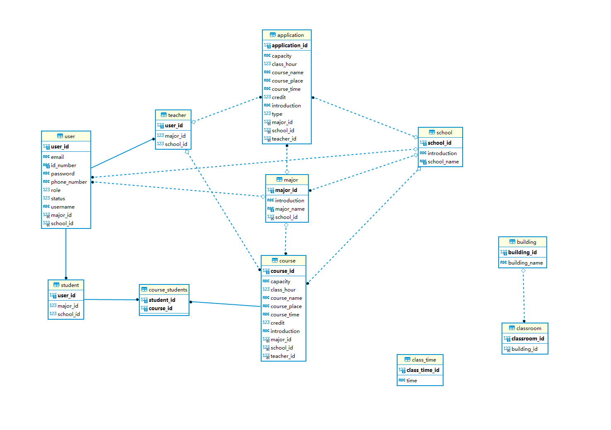
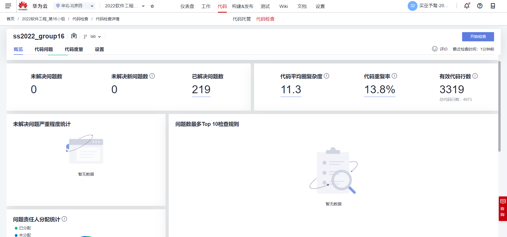

# 第16小组-Lab3实验报告

## 一、小组成员及分工

**买巫予骜：**前端开发，负责新vue工程中中登录、、退出、学生操作（修改个人信息、查看个人信息、选课、重置密码）、教师操作（修改个人信息、查看个人信息、重置密码、申请修改当前课程信息、申请删除课程、申请新增课程）、导航栏功能、全局提醒样式、权限拦截等。撰写实验报告，绘制功能流程图等。

**陆一杨：**前端开发，负责vue中管理员各页面及操作：用户增删改、csv文件上传，课程增删改、csv文件上传、审核教师请求，学院、专业增删改查、选课开放\关闭，上课时间增改、教室增删改查

**胡乐垚：**后端开发，负责有关用户，包括管理员、教师、学生的增删改查；学生选课功能；教师申请增加课程的功能；登录、注销的实现；管理员开关选课系统；获取当前登陆的用户信息给导航栏。

**李文军：**后端开发，负责有关课程，教学楼，教室，固定上课时间，专业，学院的增删改查功能；负责.csv文件批量导入用户信息与课程信息功能、管理员开关选课系统等。

## 二、实验设计

### 1、类的设计

|  编号  | 类          | 名称         | 描述                                                 |
| :----: | ----------- | ------------ | ---------------------------------------------------- |
| **1**  | School      | 学院         | 包括学院信息，学院下的专业，课程，用户               |
| **2**  | Major       | 专业         | 包括专业信息，专业所属学院，专业下的课程，用户       |
| **3**  | Course      | 课程         | 包括课程信息，课程所属学院专业，课程的教师和学生     |
| **4**  | User        | 用户         | 教师和学生的共同属性                                 |
| **5**  | Teacher     | 教师         | User的子类，新增属性有该教师的开设课程               |
| **6**  | Student     | 学生         | User的子类，新增属性有该学生的已选课程               |
| **7**  | Application | 申请         | 用于教师申请增删改课程，和管理员删除已经处理过的申请 |
| **8**  | Admin       | 管理员       | 控制选课开放关闭，处理教师的申请                     |
| **9**  | ClassTime   | 每天上课时间 | 每天第几节课的上课时间，比如从8点到8点45             |
| **10** | Classroom   | 教室         | 包含教室编号，以及所属哪一栋教学楼                   |
| **11** | Building    | 教学楼       | 包含教学楼编号，教学楼名称，以及其所有的教室         |

### 2、功能逻辑设计

#### （1）用例图

#### （2）登录功能流程图

#### （3）密码重置功能流程图

#### （4）学院专业信息维护流程图

#### （5）添加课程流程图

#### （6）添加用户流程图

#### （7）维护个人信息流程图

#### （8）学生选课流程图

#### （9）教师维护课程信息流程图

### 3、代码风格说明

#### （1）类名

本次lab中，类名采用大驼峰的命名形式，例如AdminController、 ApplicationController。

测试类命名以测试的类名开始，以 Test 结尾。

枚举类名带上Type作为后缀，枚举成员名称需要大写，单词间用下画线隔开。

#### （2）包名

包名统一第一个字母大写，其余字母小写使用小写，点分隔符之间有且仅有一个自然语义的英语单词

#### （3）空格

运算符、赋值、参数等之间使用空格来隔开各种元素之间的距离

#### （4）控制语句

if, for, while, do-while 等语句中，即使只有一行代码，也加上大括号，以便美观。

条件表达式中出现赋值操作，尽量减少在判断表达式中出现复杂的组合

#### （5）缩进与空格

代码保持良好的缩进格式，一般是四个空格，即一个TAB键。

### 4、测试用例

#### （1）登录界面

| 编号  | 用例名称                           | 前置条件     |   测试环境   | 测试类型 | 测试步骤                                               | 预期结果                       | 实际结果       | 测试执行人 | 代码编写人 | 是否解决 | 修改人 |
| :---: | ---------------------------------- | ------------ | :----------: | -------- | ------------------------------------------------------ | ------------------------------ | -------------- | ---------- | ---------- | -------- | ------ |
| **1** | 正确输入管理员账号密码             | 初始化系统后 | Chrome浏览器 | 手工测试 | 1、输入管理员账号000000;2、输入管理员密码fudan_admin。 | 正常登录，跳转至主页。         | 与预期结果相同 | 买巫予骜   | 买巫予骜   |          |        |
| **2** | 正确输入用户账号密码（首次登录）   | 用户已添加   | Chrome浏览器 | 手工测试 | 1、输入已注册用户账号。2、输入已注册用户密码。         | 正常登录，跳转至密码重置页面。 | 与预期结果相同 | 买巫予骜   | 买巫予骜   |          |        |
| **3** | 正确输入用户账号密码（非首次登录） | 用户已添加   | Chrome浏览器 | 手工测试 | 1、输入已注册用户账号。2、输入已注册用户密码。         | 正常登录，跳转至主页。         | 与预期结果相同 | 买巫予骜   | 买巫予骜   |          |        |
| **4** | 错误输入用户（管理员）账号或密码   | 初始化系统后 | Chrome浏览器 | 手工测试 | 1、错误输入用户账号。2、错误输入用户密码。             | 登录失败，网页提示错误信息。   | 与预期结果相同 | 买巫予骜   | 买巫予骜   |          |        |

#### （2）密码重置界面

| 编号  | 用例名称                               | 前置条件         |   测试环境   | 测试类型 | 测试步骤                                                 | 预期结果                                   | 实际结果                       | 测试执行人 | 代码编写人 | 是否解决 | 修改人   |
| :---: | -------------------------------------- | ---------------- | :----------: | -------- | -------------------------------------------------------- | ------------------------------------------ | ------------------------------ | ---------- | ---------- | -------- | -------- |
| **1** | 正确输入符合要求的新密码               | 用户第一次登录后 | Chrome浏览器 | 手工测试 | 1、输入合规新密码;                 2、再次输入相同密码。 | 密码重置成功，跳转至主页。                 | 与预期结果相同                 | 买巫予骜   | 买巫予骜   |          |          |
| **2** | 两次输入密码不一致                     | 用户第一次登录后 | Chrome浏览器 | 手工测试 | 1、输入合规新密码;                 2、再次输入不同密码。 | 密码重置失败，页面提示信息。               | 密码重置失败，页面无提示信息。 | 买巫予骜   | 买巫予骜   | 是       | 买巫予骜 |
| **3** | 新密码不合规（长度）                   | 用户第一次登录后 | Chrome浏览器 | 手工测试 | 1、输入长度不合规的密码; 2、再次输入                     | 密码重置失败，提示密码格式错误。           | 与预期结果相同                 | 买巫予骜   | 买巫予骜   |          |          |
| **4** | 新密码不合规（字符集）                 | 用户第一次登录后 | Chrome浏览器 | 手工测试 | 1、输入字符集不合规的密码; 2、再次输入                   | 密码重置失败，提示密码格式错误。           | 未提示，可以直接登录           | 买巫予骜   | 买巫予骜   | 是       | 买巫予骜 |
| **5** | 新密码与初始密码相同                   | 用户第一次登录后 | Chrome浏览器 | 手工测试 | 1、输入初始密码; 2、再次输入初始密码。                   | 密码重置失败，提示不能与初始密码一致。     | 与预期结果相同                 | 买巫予骜   | 买巫予骜   |          |          |
| **6** | 首次登录用户在重置密码页面点击首页     | 用户第一次登录后 | Chrome浏览器 | 手工测试 | 1、首次登录; 2、直接点击导航栏的首页                     | 申请被拦截，提示必须重置密码后才能去往首页 | 与预期结果相同                 | 买巫予骜   | 买巫予骜   |          |          |
| **7** | 首次登录用户在重置密码页面点击退出按钮 | 用户第一次登录后 | Chrome浏览器 | 手工测试 | 1、首次登录; 2、直接点击导航栏的退出                     | 退出成功，跳转到登陆页面                   | 与预期结果相同                 | 买巫予骜   | 买巫予骜   |          |          |

#### （3）主页面

| 编号  | 用例名称             | 前置条件   |   测试环境   | 测试类型 | 测试步骤             | 预期结果             | 实际结果         | 测试执行人 | 代码编写人 | 是否解决 | 修改人   |
| :---: | -------------------- | ---------- | :----------: | -------- | -------------------- | -------------------- | ---------------- | ---------- | ---------- | -------- | -------- |
| **1** | 点击进入用户管理页面 | 用户已登录 | Chrome浏览器 | 手工测试 | 输入主页超链接       | 进入主页             | 与预期结果相同   | 买巫予骜   | 买巫予骜   |          |          |
| **2** | 点击进入用户管理页面 | 用户未登录 | Chrome浏览器 | 手工测试 | 输入主页超链接       | 拦截，显示没有权限   | 进入主页，未拦截 | 买巫予骜   | 买巫予骜   | 是       | 买巫予骜 |
| **3** | 点击进入各个功能页面 | 用户已登录 | Chrome浏览器 | 手工测试 | 点击对应功能页面按钮 | 进入对应功能页面按钮 | 与预期结果相同   | 买巫予骜   | 买巫予骜   |          |          |

#### （4）用户管理页面

| 编号  | 用例名称        | 前置条件                     |   测试环境   | 测试类型 | 测试步骤                                      | 预期结果                                      | 实际结果                                                     | 测试执行人 | 代码编写人 | 是否解决 | 修改人 |
| :---: | --------------- | ---------------------------- | :----------: | -------- | --------------------------------------------- | --------------------------------------------- | ------------------------------------------------------------ | ---------- | ---------- | -------- | ------ |
| **1** | 添加用户        | 学院、专业已添加             | Chrome浏览器 | 手工测试 | 空表单提交                                    | 所有必填项提示错误信息                        | 学院、专业无错误信息提示，但空缺时表单无法提交               | 陆一杨     | 陆一杨     | 是       | 陆一杨 |
| **2** | 编辑用户        | 表中已有用户                 | Chrome浏览器 | 手工测试 | 点击编辑，点击提交                            | 行内信息回显到表单中，可直接提交              | 学院、专业下拉框中有显示值，但无法提交表单，向后端提交的用户对象中学院、专业信息为空 | 陆一杨     | 陆一杨     | 是       | 陆一杨 |
| **3** | 通过csv添加用户 | 第三方库Papaparse引入        | Chrome浏览器 | 手工测试 | 点击从csv提交，上传csv文件                    | csv中每行的值填入表单，经过表单验证提交给后端 | csv中数据读取成功，但中文存在乱码，且无法运行表单检验        | 陆一杨     | 陆一杨     | 是       | 李文军 |
| **4** | 添加用户        | 添加表单关闭后清空表单的功能 | Chrome浏览器 | 手工测试 | 添加用户，关闭表单页，再次添加                | 第二次添加正常通过                            | 表单提交失败                                                 | 陆一杨     | 陆一杨     | 是       | 陆一杨 |
| **5** | 用户状态检查    | 登录页面相关功能完善         | Chrome浏览器 | 手工测试 | 添加用户，设置状态为false，使用该用户进行登录 | 登录失败                                      | 与预期结果一致                                               | 陆一杨     | 陆一杨     |          |        |

#### （5）学院、专业管理页面

| 编号  | 用例名称     | 前置条件                       |   测试环境   | 测试类型 | 测试步骤                             | 预期结果                                       | 实际结果                                                     | 测试执行人 | 代码编写人 | 是否解决 | 修改人 |
| :---: | ------------ | ------------------------------ | :----------: | -------- | ------------------------------------ | ---------------------------------------------- | ------------------------------------------------------------ | ---------- | ---------- | -------- | ------ |
| **1** | 搜索测试     | 添加按搜索动态显示表格数据功能 | Chrome浏览器 | 手工测试 | 打开页面，搜索框输入已有学院名称字段 | 表格仅显示含字段学院数据                       | 与预期结果一致                                               | 陆一杨     | 陆一杨     |          |        |
| **2** | 空表单检查   | 学院数据为空                   | Chrome浏览器 | 手工测试 | 打开页面，学院表单为空，添加学院     | 打开页面时表单为空，添加后正常显示添加数据     | 无法添加，网页存在报错                                       | 陆一杨     | 陆一杨     | 是       | 陆一杨 |
| **3** | 删除至空表单 | 学院、专业中有数据             | Chrome浏览器 | 手工测试 | 将学院删除至空                       | 删除结束后表单为空，可正常添加                 | 最后一条数据点击删除后，数据库中数据为空，但表格内数据未更新，网页存在报错 | 陆一杨     | 陆一杨     | 是       | 陆一杨 |
| **4** | 添加专业     | 已有学院数据                   | Chrome浏览器 | 手工测试 | 添加专业，再添加学院，再添加专业     | 第二次添加专业时，学院下拉框内显示新加入的学院 | 与预期结果一致                                               | 陆一杨     | 陆一杨     |          |        |

#### （6）课程管理页面

| 编号 | 用例名称         | 前置条件               |   测试环境   | 测试类型 | 测试步骤                                                     | 预期结果                                                     | 实际结果                                                     | 测试执行人 | 代码编写人 | 是否解决 | 修改人 |
| :--: | ---------------- | ---------------------- | :----------: | -------- | ------------------------------------------------------------ | ------------------------------------------------------------ | ------------------------------------------------------------ | ---------- | ---------- | -------- | ------ |
|  1   | 课程功能测试     | 学院、专业、教师已添加 | Chrome浏览器 | 手工测试 | 添加课程、点击编辑，无改动提交课程修改，点击编辑、更改学时、学分信息，删除课程 | 添加、编辑、删除操作的数据均正常在表格中显示                 | 与预期结果一致                                               | 陆一杨     | 陆一杨     |          |        |
|  2   | 获取教师请求测试 | 使用教师账号提交请求   | Chrome浏览器 | 手工测试 | 登录教师账号，提交2次添加、修改（无改动）、修改（有改动）、删除课程请求；登录管理员账号，同意请求1,3,4,5，拒绝2 | 审核页面显示五条请求，对应操作均成功，课程变动在管理员的课程管理表格中正常显示 | 拒绝请求、同意添加课程、同意删除课程请求成功，同意修改请求失败 | 陆一杨     | 陆一杨     | 是       | 陆一杨 |

#### （7）选课管理页面

| 编号 | 用例名称              | 前置条件         |   测试环境   | 测试类型 | 测试步骤     | 预期结果                                                     | 实际结果                    | 测试执行人 | 代码编写人 | 是否解决 | 修改人   |
| :--: | --------------------- | ---------------- | :----------: | -------- | ------------ | ------------------------------------------------------------ | --------------------------- | ---------- | ---------- | -------- | -------- |
|  1   | 选课开放\关闭功能测试 | 传参接口测试通过 | Chrome浏览器 | 手工测试 | 点击关闭选课 | 点击后获取到后端传递的状态参数，禁用关闭选课按钮，激活开启选课按钮 | 向后端传参失败，网络请求400 | 陆一杨     | 陆一杨     | 是       | 买巫予骜 |

#### （8）学生/教师个人信息页面

| 编号  | 用例名称                 | 前置条件   |   测试环境   | 测试类型 | 测试步骤                                           | 预期结果                         | 实际结果                   | 测试执行人 | 代码编写人 | 是否解决 | 修改人   |
| :---: | ------------------------ | ---------- | :----------: | -------- | -------------------------------------------------- | -------------------------------- | -------------------------- | ---------- | ---------- | -------- | -------- |
| **1** | 点击进入用户个人信息页面 | 用户未登录 | Chrome浏览器 | 手工测试 | 输入用户个人信息页面                               | 拦截、显示没有权限，返回登陆页面 | 与预期结果相同             | 买巫予骜   | 买巫予骜   |          |          |
| **2** | 点击进入用户管理页面     | 用户已登录 | Chrome浏览器 | 手工测试 | 输入用户个人信息页面                               | 进入用户个人信息页面             | 与预期结果相同             | 买巫予骜   | 买巫予骜   |          |          |
| **3** | 获取个人信息             | 用户已登录 | Chrome浏览器 | 手工测试 | 刷新网页                                           | 得到全部个人信息                 | 电话号码及邮箱显示异常     | 买巫予骜   | 买巫予骜   | 是       | 胡乐垚   |
| **4** | 修改个人电话             | 用户已登录 | Chrome浏览器 | 手工测试 | 点击修改用户电话按钮，输入新电话号码，点击确定更改 | 信息预先填充，修改成功           | 信息未预先填充，但修改成功 | 买巫予骜   | 买巫予骜   | 是       | 买巫予骜 |
| **4** | 修改个人邮箱             | 用户已登录 | Chrome浏览器 | 手工测试 | 点击修改用户邮箱按钮，输入新邮箱，点击确定更改     | 信息预先填充，修改成功           | 与预期结果相同             | 买巫予骜   | 买巫予骜   |          |          |

#### （9）学生查看可选课程信息/选课

| 编号  | 用例名称                 | 前置条件   |   测试环境   | 测试类型 | 测试步骤                                     | 预期结果                                     | 实际结果                                       | 测试执行人 | 代码编写人 | 是否解决 | 修改人 |
| :---: | ------------------------ | ---------- | :----------: | -------- | -------------------------------------------- | -------------------------------------------- | ---------------------------------------------- | ---------- | ---------- | -------- | ------ |
| **1** | 点击进入可选课程信息页面 | 用户已登录 | Chrome浏览器 | 手工测试 | 点击学生主页对应功能页面按钮                 | 进入页面                                     | 与预期结果相同                                 | 买巫予骜   | 买巫予骜   |          |        |
| **2** | 获取可选课程信息         | 用户已登录 | Chrome浏览器 | 手工测试 | 进入可选课程信息页面，刷新                   | 显示全部本专业的可选课程                     | 显示全部选课程信息，而不是本专业的可选课程     | 买巫予骜   | 买巫予骜   | 是       | 胡乐垚 |
| **3** | 学生选课                 | 用户已登录 | Chrome浏览器 | 手工测试 | 进入可选课程信息页面，点击对应课程的选课按钮 | 选课成功，页面提示，刷新后该课程从列表中消失 | 选课成功，页面提示，刷新后该课程未从列表中消失 | 买巫予骜   | 买巫予骜   | 是       | 胡乐垚 |

#### （10）教师维护已有课程信息

| 编号  | 用例名称                 | 前置条件   |   测试环境   | 测试类型 | 测试步骤                     | 预期结果                                                     | 实际结果                                                     | 测试执行人 | 代码编写人 | 是否解决 | 修改人 |
| :---: | ------------------------ | ---------- | :----------: | -------- | ---------------------------- | ------------------------------------------------------------ | ------------------------------------------------------------ | ---------- | ---------- | -------- | ------ |
| **1** | 点击进入维护课程信息页面 | 用户已登录 | Chrome浏览器 | 手工测试 | 点击教师主页对应功能页面按钮 | 进入页面                                                     | 与预期结果相同                                               | 买巫予骜   | 买巫予骜   |          |        |
| **2** | 获取所有课程信息         | 用户已登录 | Chrome浏览器 | 手工测试 | 进入可选课程信息页面，刷新   | 显示全部的课程                                               | 与预期结果相同                                               | 买巫予骜   | 买巫予骜   |          |        |
| **3** | 申请课程编辑             | 用户已登录 | Chrome浏览器 | 手工测试 | 点击对应课程信息的编辑按钮   | 出现对话框，预先填充信息，修改后点击确认，申请信息会发往管理员页面 | 出现对话框，预先填充信息，修改后点击确认，申请信息未发往管理员页面 | 买巫予骜   | 买巫予骜   | 是       | 胡乐垚 |
| **4** | 申请课程新增             | 用户已登录 | Chrome浏览器 | 手工测试 | 点击页面的新增课程按钮       | 出现对话框，填写课程信息后点击确认，申请信息会发往管理员页面 | 出现对话框，填写课程信息后点击确认，申请信息未发往管理员页面 | 买巫予骜   | 买巫予骜   | 是       | 胡乐垚 |
| **5** | 申请课程删除             | 用户已登录 | Chrome浏览器 | 手工测试 | 点击对应课程信息的删除按钮   | 出现确认删除框，确认删除后申请信息会发往管理员页面           | 出现确认删除框，确认删除后申请信息未发往管理员页面           | 买巫予骜   | 买巫予骜   | 是       | 胡乐垚 |

## 三、问题及解决方案

#### （1）

**问题**：编辑用户时无法通过scope.row获取表格行内数据，显示scope不允许在此处使用。

**解决方案**：在操作栏中加入v-slot=“scope”。

#### （2）

**问题**：编辑用户时无法获取学院、专业对应的Id。

**解决方案**：将学院、专业Id信息显示在表格中，点击编辑时将行内数据回填入修改表单中。

#### （3）

**问题**：编辑用户时表单正常显示回显数据，但无法提交到后端，表单检验无报错信息；重新选择学院、专业后，提交成功。

**解决方案**：学院、专业下拉框键名改为学院、专业名，键值改为学院、专业Id

#### （4）

**问题**：从csv引入文件，前端处理csv文件，获取到的值无法进行表单检验。

**解决方案**：csv引入方式改为前端向后端提交csv文件，由后端进行检验和提交。

#### （5）

**问题：**用户管理界面点击编辑后，行内数据回显到表单中，点击添加用户时仍显示行内数据

**解决方案**：关闭表单页后将表单数据赋空值

#### （6）

**问题**：用户管理界面关闭过表单页后，二次添加用户信息提交失败

**解决方案**：问题原因原推测为表单数据赋空值后，手机号和邮箱这两个非必填信息的空值类型由字符串型变为空，导致传参出错。实际检查后发现实际为后端添加数据时要求身份证号不能与表内已有用户的相同，故返回值为FAILED。

#### （7）

**问题**：学院、专业页面，数据为空时网页报错。

**解决方案**： 原因是加入搜索功能后，列表显示内容为动态填充，将空值填充到列表内容中是不允许使用filter函数，故改为当获取后端传参为空时，不执行更新表单操作。

#### （8）

**问题**：学院、专业页面，删除学院后，该学院下的专业仍显示在表格中。

**解决方案**：后端已实现从数据库中删除相关专业，故更改为执行学院删除操作后，专业数据再次向后端获取并更新表格。

#### （9）

**问题**：vue中的methods函数调用失效

**解决方案**：加上语句const that = this ，在方法中都用that取代this

#### （10）

**问题**：nav无法根据用户信息跳转到对应的主页

**解决方案**：nav获取对应用户的身份信息，从而进行判断

#### （11）

**问题**：网站未进行权限拦截，从而可以通过url访问不同页面

**解决方案**：在localstorge中设置token值，在登录时设置，退出登录时删除，在1个小时后过期

#### （12）

**问题**：前端传给后端的数据存在格式问题

**解决方案**：统一使用FormData()对数据进行封装后传递，便能成功

#### （13）

**问题**：实体类之间的关系错误，存在不能删除学院，专业等的情况

**解决方案**：避免全部使用cascade = CascadeType.ALL，根据不同的需求合理选择

#### （14）

**问题**：实体类Application的属性与课程基本相同，但由于主键不能相同，无法将Application作为Course的子类

**解决方案**：将Application单独作为一个类

## 四、代码检查结果

## 五、缺陷管理

## 六、Tag截图

## 七、实验总结

#### （1）买巫予骜：

​        由于lab2中我们小组未使用vue框架进行前后端分离开发，导致此次lab3的开发，不仅需要重新完成lab2的所有前端页面搭建，还需要完成要求的lab3的工作，这就导致本次lab3的工作量较大。再加上前期时间安排的不够合理，进一步使得时间紧张，项目一直在赶进度，不过好在项目最终得以按时完成。虽然如此，本次lab的开发，依然让我收获满满。我不仅在lab2的基础上进一步巩固了JavaScript、css、html的相关知识，还对vue框架的使用有了更进一步的掌握，更加深刻体验到了前后端分开发的实际场景。相比于lab2的开发，因为有了部分经验，因此我们在接口的定义、项目的分工以及缺陷的及时修补上相比上一个lab有了明显的提升，这就使得开发效率大大提高，节约了大量因做无用功而浪费的时间与精力。当然本次的开发仍有不足，由于前期的时间安排不够合理，以及重新完成lab2的工作，导致后期进度一致处于比较赶的状态，因此很多本来应实现的深入的功能，都无法在本次lab中实现，譬如部署服务器以及代码评审环节等，希望这些缺陷和不足能在下一次lab中得以完善。

#### （2）陆一杨：

​        由于之前未用vue进行前端开发，导致这次的Lab许多页面和功能都要重新实现，学习和理解vue的页面构建、数值绑定、页面渲染之类的相关知识也花费了许多的时间，虽然进度很赶、工作量很大，但总体而言这次项目开发收获也非常大。本次lab需要的接口较多，但由于前后端有了更多的交流，接口和功能协调实现反而更加顺畅，开发效率与lab2相比有明显的提升。但也是由于时间进度的关系，一些报错的具体原因未能深入研究，功能的实现方式也有较大的改进空间，代码质量的提升空间也很大，若下次lab有时间会进行重构以提升代码质量。

#### （3）**胡乐垚：**

​		有了Lab2的基础，后端开发工作的进行思路更加清晰。此次Lab3新增了很多实体类，在实体类属性的分配，不同实体类的级联关系上，花费了很多时间理解和处理问题，尤其是继承映射，子类父类之间的关系，不过让我对JPA和MySQL有了进一步的了解和深入。开发期间经历了多次修改实体类而导致牵动Service和Controller修改，进而影响前端传参。本次Lab的整体开发都比较紧张，导致很多功能都不能很完美，期望在下一次迭代中完善。

#### （4）**李文军：**

​		有了之前的lab的开发经验，这次的后端开发工作思路清晰，前后端沟通也都比较及时有效。大家都为了lab 的完成付出很多精力，关于实体类的属性以及各种类之间的联系以及功能的实现在不断的讨论与协商中也愈发趋向完善。虽说本次lab时间对于我来说稍显急促，不过也好在能及时完成，并且对于JPA，各类注解，Spring boot以及整个项目有了更加深入的思考与理解，收获颇丰。但也有一些功能没有做到最完美最完善，在以后的开发中会不断思考完善，做到最好！

