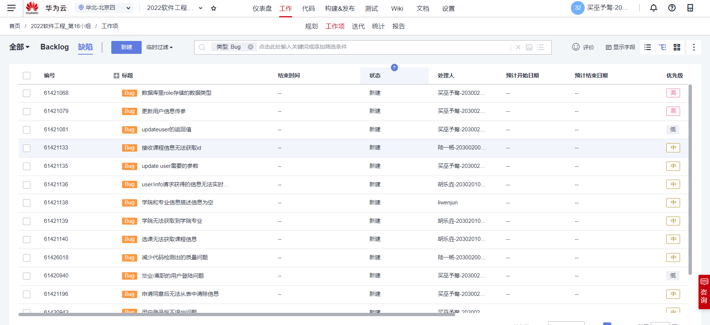

# 第16小组-Lab3实验报告

## 一、小组成员及分工

**买巫予骜：**：前端开发，负责新vue工程中中登录、、退出、学生操作（修改个人信息、查看个人信息、选课、重置密码）、教师操作（修改个人信息、查看个人信息、重置密码、申请修改当前课程信息、申请删除课程、申请新增课程）、权限拦截等。撰写实验报告，绘制功能流程图等。

**陆一杨：**

**胡乐垚：**

**李文军：**

## 二、实验设计

### 1、类的设计

### 2、功能逻辑设计

#### （1）用例图

#### （2）登录功能流程图

#### （3）密码重置功能流程图

#### （4）添加用户功能流程图

### 3、代码风格说明

### 4、测试用例

#### （1）登录界面

| 编号 | 用例名称 | 前置条件 | 测试环境 | 测试类型 | 测试步骤 | 预期结果 | 实际结果 | 测试执行人 | 代码编写人 | 是否解决 | 修改人 |
| :--: | -------- | -------- | :------: | -------- | -------- | -------- | -------- | ---------- | ---------- | -------- | ------ |
|      |          |          |          |          |          |          |          |            |            |          |        |
|      |          |          |          |          |          |          |          |            |            |          |        |
|      |          |          |          |          |          |          |          |            |            |          |        |
|      |          |          |          |          |          |          |          |            |            |          |        |

#### （2）密码重置界面

|      |      |      |      |      |      |      |      |      |      |      |      |
| :--: | ---- | ---- | :--: | ---- | ---- | ---- | ---- | ---- | ---- | ---- | ---- |
|      |      |      |      |      |      |      |      |      |      |      |      |
|      |      |      |      |      |      |      |      |      |      |      |      |
|      |      |      |      |      |      |      |      |      |      |      |      |
|      |      |      |      |      |      |      |      |      |      |      |      |
|      |      |      |      |      |      |      |      |      |      |      |      |

#### （3）主页面

| 编号 | 用例名称 | 前置条件 | 测试环境 | 测试类型 | 测试步骤 | 预期结果 | 实际结果 | 测试执行人 | 代码编写人 | 是否解决 | 修改人 |
| :--: | -------- | -------- | :------: | -------- | -------- | -------- | -------- | ---------- | ---------- | -------- | ------ |
|      |          |          |          |          |          |          |          |            |            |          |        |

#### （4）用户管理页面

| 编号 | 用例名称 | 前置条件 | 测试环境 | 测试类型 | 测试步骤 | 预期结果 | 实际结果 | 测试执行人 | 代码编写人 | 是否解决 | 修改人 |
| :--: | -------- | -------- | :------: | -------- | -------- | -------- | -------- | ---------- | ---------- | -------- | ------ |
|      |          |          |          |          |          |          |          |            |            |          |        |
|      |          |          |          |          |          |          |          |            |            |          |        |

#### （5）用户添加页面

| 编号 | 用例名称 | 前置条件 | 测试环境 | 测试类型 | 测试步骤 | 预期结果 | 实际结果 | 测试执行人 | 代码编写人 | 是否解决 | 修改人 |
| :--: | -------- | -------- | :------: | -------- | -------- | -------- | -------- | ---------- | ---------- | -------- | ------ |
|      |          |          |          |          |          |          |          |            |            |          |        |
|      |          |          |          |          |          |          |          |            |            |          |        |
|      |          |          |          |          |          |          |          |            |            |          |        |

## 三、问题及解决方案

## 四、代码检查结果

## 五、缺陷管理

## 六、Tag截图

## 六、实验总结

#### （1）买巫予骜：

​        由于lab2中我们小组未使用vue框架进行前后端分离开发，导致此次lab3的开发，不仅需要重新完成lab2的所有前端页面搭建，还需要完成要求的lab3的工作，这就导致本次lab3的工作量较大。再加上前期时间安排的不够合理，进一步使得时间紧张，项目一直在赶进度，不过好在项目最终得以按时完成。虽然如此，本次lab的开发，依然让我收获满满。我不仅在lab2的基础上进一步巩固了JavaScript、css、html的相关知识，还对vue框架的使用有了更进一步的掌握，更加深刻体验到了前后端分开发的实际场景。相比于lab2的开发，因为有了部分经验，因此我们在接口的定义、项目的分工以及缺陷的及时修补上相比上一个lab有了明显的提升，这就使得开发效率大大提高，节约了大量因做无用功而浪费的时间与精力。当然本次的开发仍有不足，由于前期的时间安排不够合理，以及重新完成lab2的工作，导致后期进度一致处于比较赶的状态，因此很多本来应实现的深入的功能，都无法在本次lab中实现，譬如部署服务器以及代码评审环节等，希望这些缺陷和不足能在下一次lab中得以完善。

#### （2）陆一杨：

​        

#### （3）**胡乐垚：**

​		

#### （4）**李文军：**

​		

