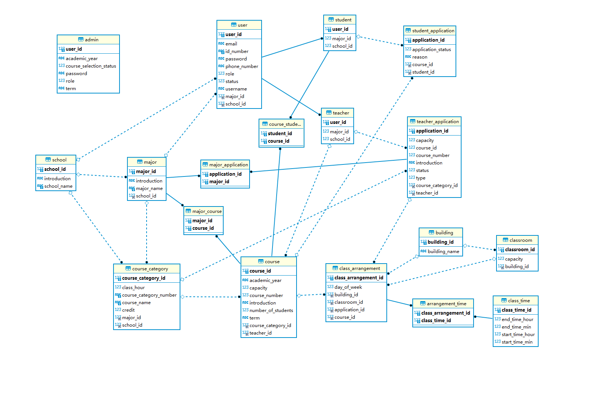

# 第16小组-Lab4实验报告

## 一、小组成员及分工

**买巫予骜：**前端开发，负责新vue工程中学生选课页面、学生查看已选课程页面、学生查看已修课程页面、学生查看选课申请、学生发送选课申请等全部前端学生相关功能，教师查看本学期上课名单及选课学生、管理员管理上课时间、管理学年学期信息等功能。撰写实验报告，绘制功能流程图等。

**陆一杨：**

**胡乐垚：**

**李文军：**

## 二、实验设计

### 1、类图

### 2、类的文字说明

|  编号  | 类          | 名称         | 描述                                                 |
| :----: | ----------- | ------------ | ---------------------------------------------------- |
| **1**  | School      | 学院         | 包括学院信息，学院下的专业，课程，用户               |
| **2**  | Major       | 专业         | 包括专业信息，专业所属学院，专业下的课程，用户       |
| **3**  | Course      | 课程         | 包括课程信息，课程所属学院专业，课程的教师和学生     |
| **4**  | User        | 用户         | 教师和学生的共同属性                                 |
| **5**  | Teacher     | 教师         | User的子类，新增属性有该教师的开设课程               |
| **6**  | Student     | 学生         | User的子类，新增属性有该学生的已选课程               |
| **7**  | Application | 申请         | 用于教师申请增删改课程，和管理员删除已经处理过的申请 |
| **8**  | Admin       | 管理员       | 控制选课开放关闭，处理教师的申请                     |
| **9**  | ClassTime   | 每天上课时间 | 每天第几节课的上课时间，比如从8点到8点45             |
| **10** | Classroom   | 教室         | 包含教室编号，以及所属哪一栋教学楼                   |
| **11** | Building    | 教学楼       | 包含教学楼编号，教学楼名称，以及其所有的教室         |

### 3、代码风格设计

#### （1）类名

本次lab中，类名采用大驼峰的命名形式，例如AdminController、 ApplicationController。

测试类命名以测试的类名开始，以 Test 结尾。

枚举类名带上Type作为后缀，枚举成员名称需要大写，单词间用下画线隔开。

#### （2）包名

包名统一第一个字母大写，其余字母小写使用小写，点分隔符之间有且仅有一个自然语义的英语单词

#### （3）空格

运算符、赋值、参数等之间使用空格来隔开各种元素之间的距离

#### （4）控制语句

if, for, while, do-while 等语句中，即使只有一行代码，也加上大括号，以便美观。

条件表达式中出现赋值操作，尽量减少在判断表达式中出现复杂的组合

#### （5）缩进与空格

代码保持良好的缩进格式，一般是四个空格，即一个TAB键。

## 三、问题及解决方案

#### （1）

**问题**：

**解决方案**：

#### （2）

**问题**：

**解决方案**：

#### （3）

**问题**：

**解决方案**：

#### （4）

**问题**：

**解决方案**：

#### （5）

**问题**：

**解决方案**：

#### （6）

**问题**：

**解决方案**：

#### （7）

**问题**：

**解决方案**：

#### （8）

**问题**：

**解决方案**：

#### （9）

**问题**：

**解决方案**：

#### （10）

**问题**：

**解决方案**：

#### （11）

**问题**：

**解决方案**：

#### （12）

**问题**：

**解决方案**：

#### （13）

**问题**：

**解决方案**：

#### （14）

**问题**：

**解决方案**：

## 四、代码检查结果

## 五、软件测试

### 1、单元测试

### 2、接口测试

### 3、系统测试

## 六、缺陷管理

## 六、Tag截图

### （1）命令行截图

### （2）华为云截图

## 七、心得体会

#### （1）买巫予骜：

​		本次Lab4基于Lab3，实现了学生选课为核心的功能。由于前几次的Lab积累下来的经验，此次lab4就进行得更加顺利。此次Lab4遇到的最大的问题是，对于前几次Lab设计的重构与调整。我们几乎是彻底修改了原来的课程类，重新设计了课程安排类，完善了教学楼与教室的设计。此外，这次我在前端开发中，设计了图形化的显示课程安排的界面、贴近真实的选课系统，并且有实时的冲突提醒，更加用户友好。此外，本次lab在前期进行了充分的讨论以及设计，因此我们在接口的定义、项目的分工以及缺陷的及时修补上相比上一个lab有了明显的提升，这就使得开发效率大大提高，节约了大量因做无用功而浪费的时间与精力。代码评审的环节也有助于我们了解组员、或者是自己代码中的问题，能够及时避免错误发生，以免后来大改。而且可以互相学习到很多更好、更规范的代码书写规则以及实现方式，对于我们的开发有很大帮助。总之，4次的lab让我在软件开发能力与知识素养方面收获良多。而将来我也将继续学习，争取能将所学运用于未来的学习与工作中。

#### （2）陆一杨：

#### （3）**胡乐垚：**

#### （4）**李文军：**

