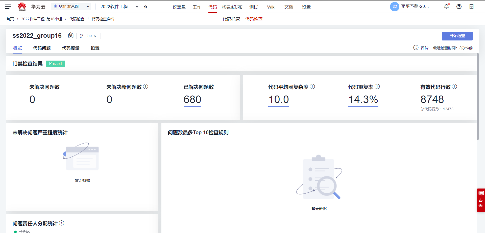
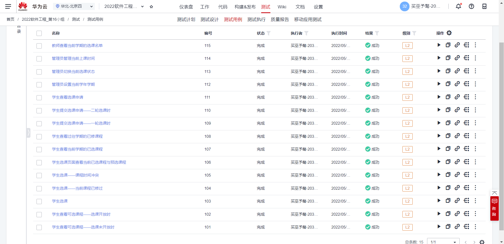
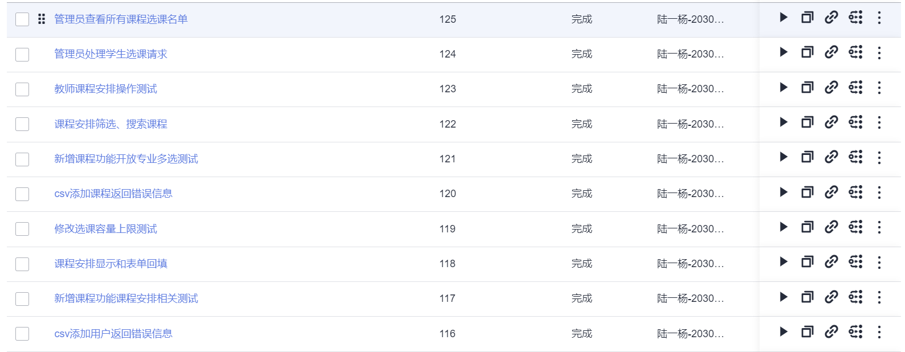
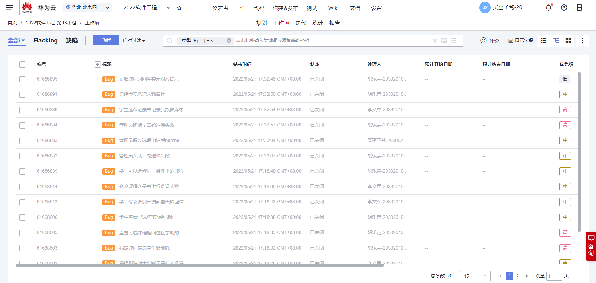
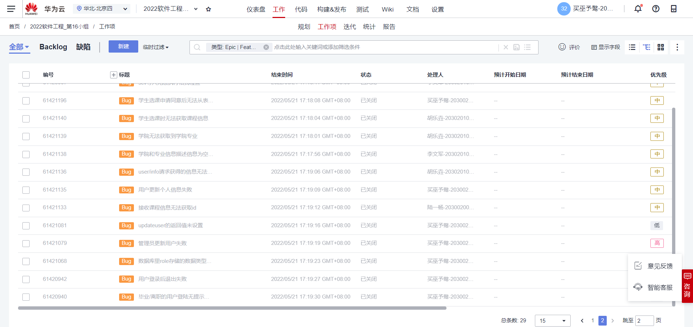

# 第16小组-Lab4实验报告

## 一、小组成员及分工

**买巫予骜：**前端开发，负责新vue工程中学生选课页面、学生查看已选课程页面、学生查看已修课程页面、学生查看选课申请、学生发送选课申请等全部前端学生相关功能，教师查看本学期上课名单及选课学生、管理员管理上课时间、管理学年学期信息等功能。撰写实验报告，绘制功能流程图等。

**陆一杨：**前端开发，本次lab中负责管理员课程管理页面、处理学生选课申请页面、查看课程选课名单页面、导出csv添加的错误信息等管理员相关功能，教师课程管理页面相关功能。

**胡乐垚：**后端开发，主要负责学生选课相关功能，包括管理员修改选课系统状态、学生获取可选课程、学生选课、学生查看所有已选已修课程、一轮选课后退出超出课程容量的学生。

**李文军：**后端开发，主要负责学生选课期退课，管理员修改课程容量，学生选课申请，管理员处理选课申请并修正课程容量，批量导入课程，用户，模糊查询等功能

## 二、实验设计

### 1、类图

### 2、类的文字说明

|  编号  | 类                 | 名称     | 描述                                                         |
| :----: | ------------------ | -------- | ------------------------------------------------------------ |
| **1**  | Admin              | 管理员   | 包括学年学期、选课系统状态信息                               |
| **2**  | School             | 学院     | 包括学院信息，学院下的专业，课程，用户                       |
| **3**  | Major              | 专业     | 包括专业信息，专业所属学院，专业下的课程，用户               |
| **4**  | CourseCategory     | 课程类   | 一类课程共有的信息                                           |
| **5**  | Course             | 课程     | 包括课程信息，课程所属学院、专业、课程类，课程的教师和学生，面向开放的专业 |
| **6**  | User               | 用户     | 教师和学生的共同属性                                         |
| **7**  | Teacher            | 教师     | User的子类，新增属性有该教师的开设课程、发出的申请           |
| **8**  | Student            | 学生     | User的子类，新增属性有该学生的已选课程、发出的申请           |
| **9**  | TeacherApplication | 教师申请 | 用于教师申请增删改课程                                       |
| **10** | StudentApplication | 学生申请 | 用于学生申请选课                                             |
| **11** | ClassArrangement   | 课程安排 | 一门课程有若干个课程安排，每个安排包含教学楼、教室、星期几、若干个上课时间 |
| **12** | Building           | 教学楼   | 包含教学楼编号，教学楼名称，以及其所有的教室                 |
| **13** | Classroom          | 教室     | 包含教室编号，以及所属哪一栋教学楼                           |
| **14** | ClassTime          | 上课时间 | 每天第几节课的上课时间，比如从8:00到8:45                     |

### 3、代码风格设计

#### （1）类名

本次lab中，类名采用大驼峰的命名形式，例如AdminController、 ApplicationController。

测试类命名以测试的类名开始，以 Test 结尾。

枚举类名带上Type作为后缀，枚举成员名称需要大写，单词间用下画线隔开。

#### （2）包名

包名统一第一个字母大写，其余字母小写使用小写，点分隔符之间有且仅有一个自然语义的英语单词

#### （3）空格

运算符、赋值、参数等之间使用空格来隔开各种元素之间的距离

#### （4）控制语句

if, for, while, do-while 等语句中，即使只有一行代码，也加上大括号，以便美观。

条件表达式中出现赋值操作，尽量减少在判断表达式中出现复杂的组合

#### （5）缩进与空格

代码保持良好的缩进格式，一般是四个空格，即一个TAB键。

## 三、问题及解决方案

#### （1）

**问题**：课程安排显示与存储格式不一致，导致编辑时无法预填充编辑表单。

**解决方案**：课程安排通过拼接字符串的方式显示，将课程安排原格式以隐藏行的形式赋值给行中相关变量，编辑时将隐藏变量赋给表单相应变量。

#### （2）

**问题**：课程安排为一条字符串，搜索课次时会将教室编号中含相同字段的课程一并显示。

**解决方案**：在表中加入隐藏行，将时间地点分别存储，搜索范围分别限制在隐藏行中。

#### （3）

**问题**：管理员查看选课名单，课程内容存在大量重复字段。

**解决方案**：使用树形结构展示，将学生信息作为课程的叶节点显示。

#### （4）

**问题**：课程已选人数在编辑课程时可能存在更新，检测课程容量是否小于已选课人数不及时。

**解决方案**：前端仅检查课程容量是否小于教室容量，是否小于已选人数由后端进行检查，如果小于选课人数将返回错误信息给前端。

#### （5）

**问题**：学生查看课表时，无法正确根据课程信息显示颜色

**解决方案**：是因为页面加载时dom元素没有加载完全的原因所致，所以给显示函数增加一个300ms的延迟就可以了。

#### （6）

**问题**：学生选课页面，学生点击课程详情的时候无法对冲突课程正常上色。

**解决方案**：是因为课程类中的上课安排的命名问题，已经在函数里修改，并且可以正常运行。

#### （7）

**问题**：当前课程类设计无法满足同一课程编号下开设多门课程的要求。

**解决方案**：新增课程类CourseCategory类，存储同一编号课程的相同信息，如课程编号，学分，学时等信息

#### （8）

**问题**：系统每次重新运行后当前系统的时间都会回到默认值

**解决方案**：用一个数据表来存储当前的学年学期信息

#### （9）

**问题**：当前学生查看课表会返回过往所有学期的课程

**解决方案**：新增一个只返回当前学期学生所选课程的接口

#### （10）

**问题**：用户修改个人信息功能出现问题

**解决方案**：将传到后端的参数从form个格式转换为json格式

#### （11）

**问题**：教师查看当前学期的选课名单也会返回过往所有学期的课程名单

**解决方案**：修改对应接口，默认只返回当前学期的选课名单

#### （12）

**问题**：管理员审批选课申请后，选课申请会从数据库中删除

**解决方案**：在选课申请的数据表中新增一个状态属性，表示当前申请的审核状态

#### （13）

**问题**：修改课程选课容量时，可以低于当前已选人数

**解决方案**：在后端实现方法中增加该项检测，并且返回对应的返回值。

#### （14）

**问题**：course类中无法返回当前课程已选课学生的人数

**解决方案**：在course类中新增numberofstudent属性表示已选学生人数。

……

## 四、代码检查结果

## 五、软件测试

### 1、单元测试

### 2、接口测试

### 3、系统测试

## 六、缺陷管理

### 1、缺陷管理页面截图

### 2、缺陷管理记录说明

#### 1)缺陷的描述

本次Lab缺陷描述均采用**主语+谓语+宾语+结果**的描述规则，主语为当前缺陷的产生主体，谓语为当前缺陷的产生动作，宾语为当前缺陷的作用对象，结果描述缺陷的具体情况，如返回值，错误值等。

#### 2)缺陷的分析

首先根据出错的产生动作，判断是否是前端或者是后端的原因。若是向后端发送请求，则打开控制台，记录请求的类型、名称、返回值等细节，写入华为云缺陷记录系统。若是前端的问题，则记录当前样式、数据显示显示、页面跳转等发生的问题，写入华为云缺陷记录系统，并根据当前缺陷的产生主体指派固定的解决人解决相应问题。

#### 3)缺陷的严重程度

华为云上缺陷的重要程度分为**关键、重要、一般、提示**4个级别。

**提示**：缺陷产生的后果不严重，仅仅影响用户体验，或者系统展示不够人性化等。如系统字号选择，提示信息框颜色选择等。

 **一般**：缺陷的产生会影响使用，但是不严重。如错别字、 字体错误、 数据显示位置错误等

**重要**：缺陷的产生影响使用，但是不影响系统核心功能的正常运行。如用户修改个人信息失败等功能的确实，但是不影响选课系统的选课核心功能。

**关键**：缺陷的产生严重影响使用，使得核心功能无法实现、甚至是造成系统奔溃。如学生无法进行选课、管理员无法切换学期状态等功能错误。

#### 4)缺陷的优先级评定

华为云上缺陷解决的优先级分为**高、中、低**三个档次。

**低**：对应提示或者是一般的bug，在时间充足时修复。

**中**：对应修改时间充裕的重要bug，开发者看到后尽快修复。

**高**：对应关键bug，或者是修改时间紧张的重要bug，开发者看到后应在第一时间修复。

#### 5)后续跟踪情况

项目负责人定时对华为云上记录的缺陷进行跟踪，查看开发者的解决情况，并在微信群上进行通知提醒。在项目提交验收之前进行整体性的检查。

## 六、Tag截图

### （1）命令行截图

### （2）华为云截图

## 七、心得体会

#### （1）买巫予骜：

​		本次Lab4基于Lab3，实现了学生选课为核心的功能。由于前几次的Lab积累下来的经验，此次lab4就进行得更加顺利。此次Lab4遇到的最大的问题是，对于前几次Lab设计的重构与调整。我们几乎是彻底修改了原来的课程类，重新设计了课程安排类，完善了教学楼与教室的设计。此外，这次我在前端开发中，设计了图形化的显示课程安排的界面、贴近真实的选课系统，并且有实时的冲突提醒，更加用户友好。此外，本次lab在前期进行了充分的讨论以及设计，因此我们在接口的定义、项目的分工以及缺陷的及时修补上相比上一个lab有了明显的提升，这就使得开发效率大大提高，节约了大量因做无用功而浪费的时间与精力。代码评审的环节也有助于我们了解组员、或者是自己代码中的问题，能够及时避免错误发生，以免后来大改。而且可以互相学习到很多更好、更规范的代码书写规则以及实现方式，对于我们的开发有很大帮助。总之，4次的lab让我在软件开发能力与知识素养方面收获良多。而将来我也将继续学习，争取能将所学运用于未来的学习与工作中。

#### （2）陆一杨：

​		由于前一次lab对上课时间地点的输入和展示方式设计不够合理，本次lab对课程安排和课程添加方式有了比较大的调整，我的主要工作就在于修改课程信息的处理和提取、展示方式。由于可供参考的相似案例几乎找不到，很多时候只能是通过不断修改格式查看返回信息，逐步调整完成相关数据的绑定和显示，其中在接口传值的相关问题解决上也是和负责后端的同学一同调试，逐步查明问题所在。虽然这个过程非常煎熬，但这种逐步查找、不断调试的过程方法和心态的调整，以及最后终于让程序按预期执行的这种经历，我觉得是我这次lab最大的收获之一。此外，这次lab还加入了文件导出、表格实时搜索显示、动态增删表单栏、树型显示等新功能，对这些功能的学习和开发过程中问题的处理和解决也让我受益颇多。这次lab的开发效率较高，我认为这部分源于本次开发过程中前后端对发现问题和需求描述的及时反馈和处理，极大地提高了项目的推进速度，避免由于某个功能阻塞其他部分的情况。在将来的学习和工作中，我也会保持这种团队意识和习惯。

#### （3）**胡乐垚：**

​		由于上次lab的遗留问题和此次lab新增功能，前期主要在重新修改实体类和Service，增加和修改的合理性判断是最改动最多，也是最复杂的部分，尤其是课程的增加和修改前的合理性判断，在如此复杂的代码中保持思路清晰是很重要的。为了华为云上代码问题清零，之前很多不符合要求的方法都进行了重新修改，对于代码复杂度过高的，需要按照合理的方式拆分为多个方法。虽然重新修改代码的过程很枯燥，但也让我思考为什么以往的代码不符合要求，以及如何优化逻辑和算法让代码更容易理解和复杂度降低。

​		该学期的学习让我受益匪浅，从最开始的一筹莫展，学习并渐渐熟悉Spring框架，到现在一个能运行的项目，我深刻体会到团队分工合作的力量和重要性。

#### （4）**李文军：**

​		本次lab中，我的主要工作更多的在于修改之前lab所遗留的问题以保证更好的与新功能结合，并且在测试中对于postman的运用更加得心应手，前后端的交流也是比以往更加充分及时，保证了本次lab开发高效，正确地进行。本次lab中所完成的两个功能使我基于spring框架对于文件处理的了解愈加深入与广泛。另外，对于华为云上代码问题的清零，也是绞尽脑汁花尽心思去思考如何使得代码结构更加清晰与符合要求，这极大地促进，加深了我对代码复杂度与逻辑结构的认识与了解，让我意识到在开发中保持清晰的头脑，易懂，简洁的逻辑架构是非常重要，便于维护与迭代的，令我受益颇多。在开发中，应该要时刻保持正确，优秀的开发习惯，这将极大程度上减少后期修改或者维护的工作量。我将在以后的开发中，结合本学期课程lab开发中所领悟到学习到的知识与经验，增强自身的团队沟通与协作能力。
